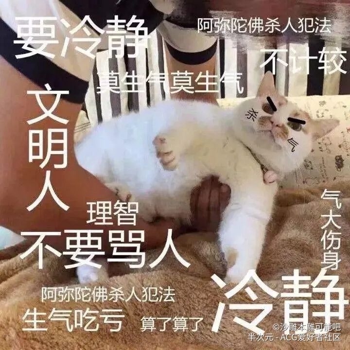

## 2019 总结
---
总结来说 就是相对于 2019年初计划。我 干（屁）的（事）不（没）错（干）！！！！
今年是在用户体验部最开心的一年，以及我的各位小伙伴，结果年底前端部门解散，拆分到项目组，真特么玩我呢...********
---

### 做了什么
---
其实,总的算起来。我也达到了一点。
1.也算是入门了React，但还没有实战经历。听说React更新了，等出教程也跟着实战来一遍。
2.Git从以前无脑push，也初次接触了gitflow，也看到了带来的好处。哈哈哈 今晚也是拼团买了git三剑客，待我啃完升职加薪，走上人生巅峰。
3.年初定了要读10本书....我特么加上读小说也没读到10本...webpack就啃了40页 css选择器世界我读了封皮..我废了 我忏悔，我2020一定重新做人。
4.公司培训，算是完成了年初的任务。Vue Es6 前后端分离 CSS+HTML JS 都完成了部门或公司培训，待我奖励自己一顿炸鸡。
5.Vue模板也通过一年打磨，推出了Base版本，使用项目20+也算是完成了承诺,也打包成了脚手架 vue create --preset he8hepeng/cli3 <app-name>
6.也终于有了自己维护的NPM模块，也算是给自己增加了一点加分项吧。
7.啃完了Es6
8.尽了把师傅的责任
9.当上了前端技术负责人 T.T
---

#### 吐槽
---
在某宇呆了两年半了,我的前端经验也马上三年。心底还是感谢公司带给我的成长,但最近的公司氛围还是让我感到恐慌。
累的永远是有技术的人，也看到了很多有才干有抱负的人离开。也送走了好多合作愉快的项目经理及大神开发。
公司不注重前端，毕竟是卖软件的 更偏向数据和业务无可厚非。但前后端分离的问题，还是让前端累的喘不过气。
ATY6的淫威，让我怕怕....
下半年前端团队分了合 合了分，元旦毫无预兆的拆组分入项目团队，让人寒心。
耗费无数个夜晚来工作和学习，终于成为高级前端，但领导却认为听话的人就是准高级。。。真是让我苦笑。。。
日子还得过，只能不断地充实自己，不断地努力，才能不被这些挫折所影响，加油！
---
### 明年计划（flag）
---
1.心怡的工作。
2.读10本书。
3.啃完TypeScript和webpack以及React
4.身体健康，培养一门兴趣爱好。可以试试吉他，毕竟我会弹棉花。
5.旅游
6.如果可能的话...得到徒弟的认可.
7.每周一篇博客
---